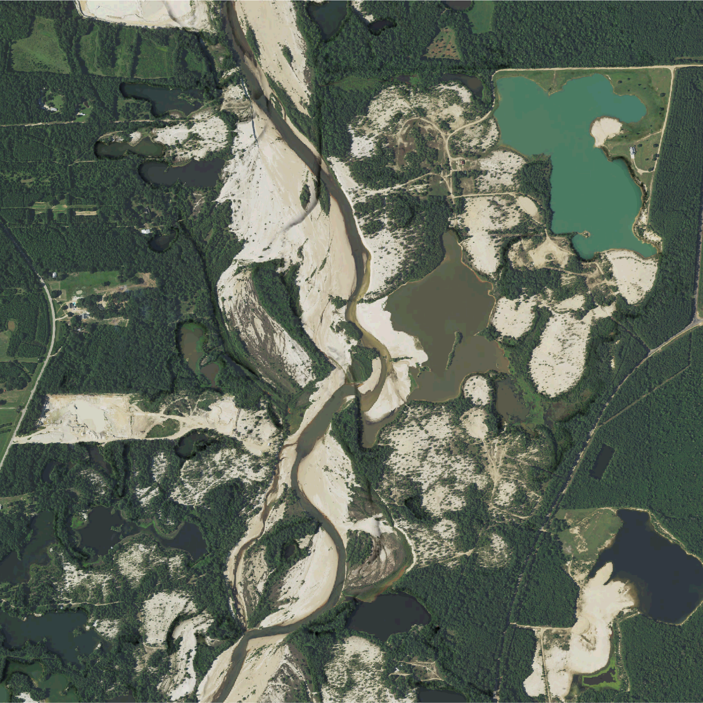

# Water Systems Studio

**The Water Systems Studio**
is an introduction to the design and restoration of hydrological systems.
This studio will address the derelict gravel mines on the Amite River
that have straightened the course of the river,
increased erosion and sediment loads,
and heightened flooding downriver.
In this studio you will learn how
the flow of water and topographic form interact.

**Objectives**
* To map and analyze hydrological systems
* To understand how processes and forms interact
* To design processes as well as forms
* To design for disturbed landscapes

---

**Syllabus** |
[2018](water-studio-syllabus-2018.pdf)

**Assignments** | [Projects](projects.md) | [Readings](readings.md) | [Terminology](terminology.md)

**Software** | [GRASS GIS](https://grass.osgeo.org) |
[Rhino](https://www.rhino3d.com/)

**Add-ons** |
[r.geomorphon](https://grass.osgeo.org/grass72/manuals/addons/r.geomorphon.html) |
[r.skyview](https://grass.osgeo.org/grass72/manuals/addons/r.skyview.html) |
[r.lake.series](https://grass.osgeo.org/grass72/manuals/addons/r.lake.series.html) |
[r.stream](https://grasswiki.osgeo.org/wiki/R.stream.*_modules) |
[Grasshopper](http://www.grasshopper3d.com/) |
[RhinoTerrain](http://www.rhinoterrain.com/en/home.html) |
[Neon](http://v5.rhino3d.com/group/neon)

**Tutorials** |
[Intro to GRASS GIS](http://ncsu-geoforall-lab.github.io/grass-intro-workshop/) |
[Geospatial Modeling Course](https://github.com/baharmon/geospatial-modeling-course) |
[lecture.lsu.edu/](https://lecture.lsu.edu/)

---

## Contents

Site visit | [Kayaking the Amite](projects.md#kayaking-the-amite)

1. **The Amite River Basin**
    1. [Introduction](.md)
    1. [Topography](.md)
    1. [Hydrology](.md)
    1. [Diagramming](.md)
    1. [Site selection](.md)

Project | [Mapping the Amite](projects.md#mapping-the-amite)

Site visit | [Amite gravel mines](projects.md#amite-gravel-mines)

2. **The Amite Gravel Mines**
    1. [Inventory](.md)
    1. [Digital fabrication](.md)
    1. [Imagery](.md)
    1. [Flows](.md)
    1. [History](.md)

Project | [Modeling the Amite](projects.md#modeling-the-amite)

Site visit | [LSU Center for River Studies](projects.md#lsu-center-for-river-studies)

3. **Generative Water Systems**
    1. [Bioengineering](bioengineering.md)
    1. [Generative morphology](.md)
    1. [Spatial catalysts](.md)
    1. [Physical simulation](.md)
    1. [Generative design](.md)

Project | [Restoring the Amite](projects.md#restoring-amite)

---

## Network drives
Students enrolled in the Louisiana State University course
LA 7031 Water Systems Studio
should submit their work via the course network drive.
* Windows: `\\desn-knox.lsu.edu\Landscape-Classes`
* Mac: `smb://desn-knox.lsu.edu/Landscape-Classes`

Data and other resources are available on the lab network drive.
* Windows: `\\desn-knox.lsu.edu\CADGIS_SHARE`
* Mac: `smb://desn-knox.lsu.edu/CADGIS_SHARE`

## License
Open educational materials licensed CC BY-SA 4.0
by Brendan Harmon :monkey_face:.
The license does not apply to logos, fonts, linked material, quotations, or
reprinted images by other authors, which may have different licenses.
The fonts used in this repository are licensed under the SIL Open Font License
by their authors. The syllabus is based on a latex template by Kieran Healy
hosted at https://github.com/kjhealy/latex-custom-kjh.
